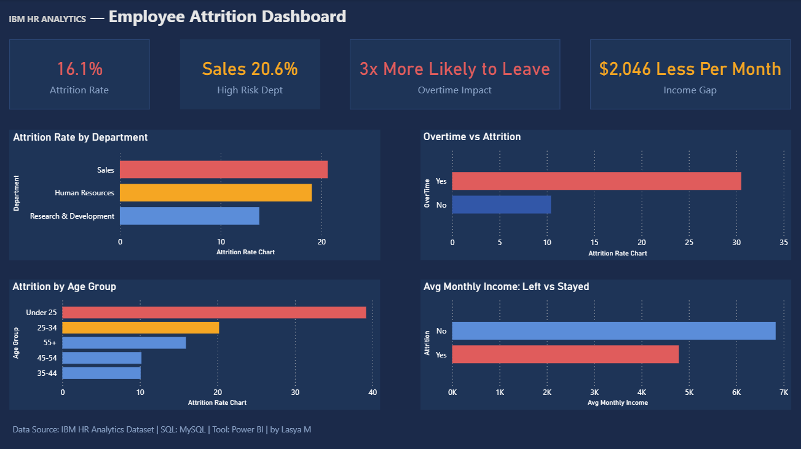

# IBM HR Analytics — Employee Attrition Analysis

## Project Overview
Analyzed IBM HR Analytics dataset of 1,470 employees to identify key drivers of employee attrition and provide actionable retention recommendations for HR stakeholders.

## Problem Statement
The company is experiencing a 16.1% attrition rate. HR needs to understand WHY employees are leaving and WHO is most at risk so they can take preventive action.

## Tools Used
- **MySQL** — Data storage and analysis
- **Power BI** — Interactive dashboard and visualization

## Dataset
- Source: IBM HR Analytics Employee Attrition Dataset (Kaggle)
- 1,470 employees, 35 columns
- Key fields: Age, Department, MonthlyIncome, OverTime, Attrition

## Key Findings
| # | Finding | Insight |
|---|---------|---------|
| 1 | Overall attrition rate is **16.1%** | 237 out of 1,470 employees left |
| 2 | **Sales** department has highest attrition at **20.6%** | 1 in 5 Sales employees leave |
| 3 | Employees working **overtime are 3x more likely** to quit | 30.5% vs 10.4% attrition rate |
| 4 | Employees who left earned **$2,046 less per month** | Avg $4,787 vs $6,833 |
| 5 | **Under 25 age group** has highest attrition at **39.2%** | Nearly 1 in 2 young employees leave |

## Recommendations
1. **Reduce overtime in Sales** — Overtime is the strongest predictor of attrition. Cap overtime hours, especially in the Sales department.
2. **Review compensation for junior roles** — The $2,046 income gap suggests underpaying is driving exits. Conduct a salary benchmarking exercise.
3. **Create retention programs for young employees** — Under 25s are leaving at nearly 40%. Mentorship programs and clear career paths can help retain them.
4. **Focus retention efforts on Sales department** — With 20.6% attrition, Sales needs immediate attention before it impacts revenue.

## Dashboard Preview

## SQL Queries
All analysis queries are available in the `queries/` folder.

## Author
Lasya Manchikalapudi | Aspiring Data Analyst  
